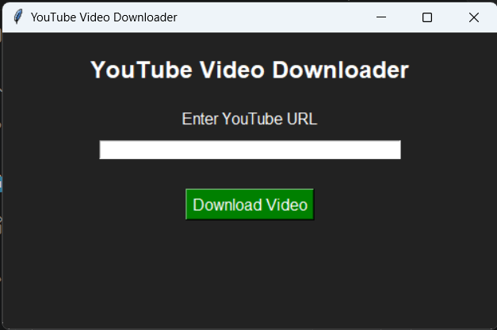
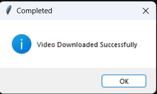

### INTERN ID: CITS2067
## 🎬 YouTube Video Downloader
A Python-based YouTube Video Downloader application with a simple graphical user interface (GUI).

This project allows users to download YouTube videos by entering a video URL and selecting a download location.

---
## 📌 Project Overview
The YouTube Video Downloader is a desktop application built using Python.

It uses the YouTube video processing library to fetch video streams and download videos directly to the user's selected folder.

The application provides an easy-to-use interface without requiring command-line knowledge.

---

## 🚀 Features
- ✅ Download YouTube videos
- ✅ Simple and user-friendly GUI
- ✅ Enter YouTube video URL
- ✅ Select custom download folder
- ✅ Downloads highest available video quality
- ✅ Error handling for invalid inputs
- ✅ Lightweight desktop application

---
## 🛠️ Technologies Used
- **Python**
- **Tkinter** (Graphical User Interface)
- **Pytubefix** (YouTube video downloading library)

---
## 📂 Project Structure
YouTube_Video_Downloader/

│

├── main.py
│ └── Main application file
│ └── Contains GUI design using Tkinter
│ └── Takes YouTube URL input
│ └── Downloads videos using Pytubefix
│ └── Handles errors and user messages

│

├── requirements.txt
│ └── Stores all required Python libraries
│ └── Contains project dependencies

│

├── README.md
│ └── Project documentation file
│ └── Includes features, installation steps and usage details

│

└── venv/
└── Virtual environment folder
└── Contains installed Python packages for this project

---

## ⚙️ Installation and Setup
### 1. Clone the Repository
Download or clone the project from GitHub:
'''bash
git clone YOUR_REPOSITORY_URL
'''

---

### 2. Open Project Folder
Open the project folder in Visual Studio Code.

Steps:

1. Open Visual Studio Code

2. Click on File → Open Folder

3. Select the project folder:

'''text
YouTube_Video_Downloader
'''

4. Click **Open**

You can also open the project using terminal:

'''bash
cd YouTube_Video_Downloader
'''

---
### 3. Create Virtual Environment

Create a virtual environment for the project:

'''bash
python -m venv venv
'''

---
### 4. Activate Virtual Environment

For Windows:

'''bash
venv\Scripts\activate
'''

After activation, you will see:

'''
(venv)
'''

in the terminal.

### 5. Install Required Libraries

Install all project dependencies:

'''bash
pip install -r requirements.txt
'''

---
### 6. Run the Application

Start the YouTube Video Downloader:

'''bash
python main.py
'''

---

## 🖥️ How to Use

1. Open the application

2. Enter the YouTube video URL

3. Click the Download Video button

4. Select the folder where you want to save the video

5.Wait until the download is completed

---

# 📦 Requirements

Before running the project, make sure you have the following installed:

## Software Requirements

- Python 3.x
- Visual Studio Code
- 
## Python Libraries
- pytubefix

## 📸 Application Preview

### YouTube Video Downloader Interface

---

### Download Completed

---

## 🚀 Future Improvements
- Add download progress bar
- Add video quality selection
- Add audio-only download option
- Add playlist downloader
- Improve user interface design

---

## 👩‍💻 Author
**Mayuri Matteddula**

Python Developer | Software Development Enthusiast

GitHub Profile:
https://github.com/matteddulamayuri24-creator

---

## 🤝 Support
If you like this project, consider giving it a ⭐ on GitHub.

For any issues, suggestions, or improvements:

- Open an issue in the GitHub repository
- Share your feedback to help improve the project
  
Thank you for visiting this project! 🚀

## 📄 License
This project is created for educational purposes.
